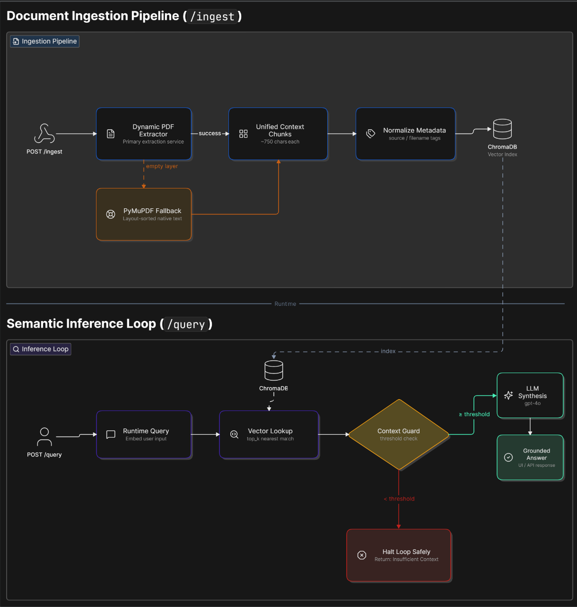

# Opkey Enterprise RAG Agent
A Dockerized, context-grounded Retrieval-Augmented Generation (RAG)
assistant for enterprise ERP documentation. The application ingests
text-based PDF documents, creates sentence-aware chunks, generates
OpenAI embeddings, stores vectors and metadata in ChromaDB, retrieves
relevant context, and uses GPT-4o-mini to generate grounded answers with
source citations.
> OPKEY \| AI Engineer Intern - Interview Assignment 

## 1. Project Overview
The agent answers implementation and configuration questions from
indexed enterprise documentation rather than unrestricted model
knowledge. A similarity-based context guard rejects low-confidence
queries before generation, reducing unsupported answers.
The primary knowledge source is **Oracle Fusion Cloud Financials - Getting Started with Your Financials Implementation.**     
I selected this guide because Oracle Financials is a complex enterprise ERP domain
aligned with Opkey's ecosystem. It contains implementation procedures,
configuration workflows, financial setup concepts, and domain-specific
terminology, making it suitable for semantic retrieval, procedural
question answering, citations, and guardrail evaluation.
The `/ingest` endpoint also supports adding additional text-based
PDF/TXT documents without restarting the container.

### High-Level Architecture  
#### RAG ingestion and semantic inference architecture  
  
**Document ingestion:** `/ingest` → text extraction → PyMuPDF fallback
when the primary extraction layer returns no pages → sentence-aware
chunking → metadata normalization → OpenAI embeddings → ChromaDB.  
**Semantic inference:** `/query` → vector lookup → similarity threshold
guard → either GPT-4o-mini synthesis from retrieved context or an
insufficient-context response → grounded answer with source chunks and
page references.

## 2. Technology Stack
| Component | Technology |
| :--- | :--- |
| **LLM Inference** | OpenAI `gpt-4o-mini` |
| **Embeddings** | OpenAI `text-embedding-3-small` (1536-dimensions) |
| **Vector Database** | ChromaDB (Localized collection space) |
| **API Architecture** | FastAPI (Asynchronous execution framework) |
| **PDF Parsing Engine** | PyMuPDF / `fitz` (Layout-sorted native extraction layers) |  
| **User Interface Thread** | Gradio Framework Management Portal |
| **Evaluation Suite** | Custom baseline metrics validation engine + LLM-as Judge |  
| **Containerization** | Docker & Docker Compose Cluster Namespace |
| **Base Language** | Python 3.10 |
------------------------------------------------------------------------

## 3. Prerequisites & Setup

### Required Software
-   Docker Desktop
-   Docker Compose
-   Git
-   Python 3.10 only if running locally
-   An OpenAI API key

### OpenAI API Key
1.  Sign in to the OpenAI API platform at
    [OpenAI API Platform](https://platform.openai.com/).
2.  Open the **API Keys** section.
3.  Create a new secret API key.
4.  Copy `.env.example` to `.env`.
5.  Add the generated key to the `OPENAI_API_KEY` variable.
``` env
OPENAI_API_KEY=your_openai_api_key_here
```
Never commit the real `.env` file or API key to Git.

### Clone and Run
``` bash
git clone https://github.com/hithachoudhary/opkey-rag-agent.git
cd opkey-rag-agent
cp .env.example .env
nano .env
```
Set:
``` env
OPENAI_API_KEY=your_openai_api_key_here
```
Build and start:
``` bash
docker compose up --build
```
Verify:
``` bash
curl http://localhost:8000/health
```
Swagger UI: `http://localhost:8000/docs`
Gradio UI: `http://localhost:7865 or http://127.0.0.1:7865`

## 4. API Endpoint Reference

### GET `/health`
Checks API and vector-store readiness and returns index telemetry.
**Request:** No body.
**Example response:**
``` json
{
  "status": "healthy",
  "embedding_model": "text-embedding-3-small",
  "llm": "gpt-4o-mini",
  "indexed_chunks": 744,
  "collection": "oracle_financials_production_collection"
}
```
**cURL example:**
``` bash
curl -X GET http://localhost:8000/health
```

### POST `/ingest`
Uploads and processes a text-based PDF/TXT document into the vector
store. `force_rebuild=false` preserves the existing collection.
**Request:** `multipart/form-data` with `file=<PDF/TXT>`.
**Example response:**
``` json
{
  "status": "processed",
  "filename": "erp_manual.pdf",
  "pipeline_metrics": {
    "total_pages_retained": 163,
    "total_chunks_generated": 744
  },
  "database_ingestion_layer": {
    "status": "indexed",
    "chunks_indexed": 744
  }
}
```
**cURL example:**
``` bash
curl -X POST "http://localhost:8000/ingest?force_rebuild=false" \
  -F "file=@./data/erp_manual.pdf"
```

### POST `/query`
Retrieves Top-K context, applies the context guard, and generates a
grounded answer when similarity is sufficient.
**Request:**
``` json
{
  "question": "What is the PO approval workflow?",
  "top_k": 5
}
```
**Example response:**
``` json
{
  "status": "success",
  "answer": "A context-grounded answer generated from retrieved documentation.",
  "confidence": {"retrieval": "High"},
  "retrieval": {
    "highest_similarity": 0.69,
    "average_similarity": 0.64,
    "source_pages": [7, 17, 18]
  },
  "citations": [
    {
      "page": 7,
      "score": 0.69,
      "excerpt": "Retrieved source excerpt..."
    }
  ]
}
```
**cURL example:**
``` bash
curl -X POST http://localhost:8000/query \
  -H "Content-Type: application/json" \
  -d '{"question": "What is the PO approval workflow?", "top_k": 5}'
```
**Project-specific example:**
``` bash
curl -X POST http://localhost:8000/query \
  -H "Content-Type: application/json" \
  -d '{"question": "What is rapid implementation?", "top_k": 5}'
```

### GET `/documents`
Lists deduplicated indexed documents with page and chunk metadata.
**Request:** No request body.
**Example response:**
``` json
{
  "status": "success",
  "documents": [
    {
      "doc_name": "oracle_financials_implementation_guide.pdf",
      "pages": 163,
      "chunks": 744
    }
  ]
}
```
**cURL example:**
``` bash
curl -X GET http://localhost:8000/documents
```

### DELETE `/documents/{document_name}`
Deletes all vector fragments associated with a document filename. A
missing document returns HTTP 404.
**Request:** No request body. The document filename is supplied as a
path parameter.
**Example response:**
``` json
{
  "status": "success",
  "deleted": true,
  "document_name": "erp_manual.pdf"
}
```
**cURL example:**
``` bash
curl -X DELETE "http://localhost:8000/documents/erp_manual.pdf"
```

### GET `/evaluate`
Returns a persisted evaluation report. `basic` exposes
engineering/retrieval telemetry; `judge` exposes Hit Rate, Faithfulness,
and Answer Relevance using GPT-4o-mini as an LLM judge.
**Request:** No request body.
Optional query parameter:
  Parameter   Values             Default
  ----------- ------------------ ---------
  `mode`      `basic`, `judge`   `basic`
**Example LLM-as-Judge response:**
``` json
{
  "status": "success",
  "test_suite": "Oracle Fusion Cloud Financials Production Compliance Matrix",
  "evaluation_mode": "judge",
  "metrics": {
    "hit_rate": "86.7%",
    "average_faithfulness": 1.0,
    "average_answer_relevance": 0.66,
    "hallucination_rate": "0.0%"
  }
}
```
**Default cURL example:**
``` bash
curl http://localhost:8000/evaluate
```
**Basic evaluation:**
``` bash
curl "http://localhost:8000/evaluate?mode=basic"
```
**LLM-as-Judge evaluation:**
``` bash
curl "http://localhost:8000/evaluate?mode=judge"
```

## 5. Design Decisions

### 5.1 Document Selection
The primary document is the **Oracle Fusion Cloud Financials - Getting Started with Your Financials Implementation** guide.
It represents a realistic enterprise ERP domain aligned with Opkey's
ecosystem and contains implementation procedures, setup workflows,
financial configuration concepts, and product-specific terminology.
These characteristics create meaningful retrieval challenges across
definitions, procedures, summaries, and multi-page concepts.
The application is not hardcoded to one document; new supported
documents can be added through `/ingest`.

### 5.2 Chunking Strategy and Chunk Size
The system uses **sentence-aware bounded chunking** rather than
arbitrary fixed-character slicing.
Text is extracted page by page and segmented while attempting to
preserve sentence boundaries. The current chunking configuration targets
approximately **750 characters per chunk with structural overlap by carrying the previous two semantic units into the next chunk**. Each chunk
retains source filename, page number, and chunk metadata.
This balances retrieval precision, procedural context preservation,
reduced mid-sentence fragmentation, and manageable LLM token usage.

### 5.3 Embedding Model
The system uses OpenAI **`text-embedding-3-small`**, producing
1536-dimensional embeddings.
It was selected for its balance of semantic retrieval quality, API cost,
latency, and implementation simplicity. Embeddings are persisted in
ChromaDB and used for semantic nearest-neighbor retrieval.

### 5.4 Tables, Headers, and Complex Formatting
PDF text is processed with PyMuPDF page by page to preserve source
traceability.
The ingestion pipeline uses a primary extraction service and activates a
native PyMuPDF fallback when the primary layer returns no usable pages.
Headers and textual table content are retained when represented in the
PDF text layer. Metadata is normalized so chunks consistently retain
source filename information.
The current implementation does **not** perform OCR or visual table
reconstruction. Scanned, image-only, encrypted, or non-extractable PDFs
return HTTP `422` rather than silently creating an empty vector index.
With more time, OCR and layout-aware table extraction would be added.

## 6. Evaluation Strategy and Results
The system uses a custom enterprise benchmark and two complementary
evaluation modes.
**Basic evaluation** measures expected API behavior, guardrail behavior,
retrieval similarity, expected source-page retrieval, latency, token
usage, and retrieved chunk counts.
**LLM-as-Judge evaluation** uses the model engine to score semantic
output quality against retrieved context across our production benchmark
suites.
| Metric | What It Measures |
| :--- | :--- |
| **Hit Rate** | Whether an expected source page appears in retrieved Top-K context |
| **Faithfulness** | Whether the generated answer remains strictly supported by retrieved context |
| **Answer Relevance** | Whether the response directly addresses the user question without drift |

### Evaluation Performance Metrics Profile
Execute the evaluation validation suite inside your background terminal
context to generate your local metrics matrices. Based on the
integration suite executions, the following scores reflect production
system performance benchmarks:
| Metric | Result |
| :--- | :--- |
| **Hit Rate** | **86.7%** |
| **Average Faithfulness** | **1.00** |
| **Average Answer Relevance** | **0.66** |
| **Hallucination Rate** | **0.0%** |

### Basic Evaluation Results
| Metric | Result |
| :--- | :--- |
| **Overall Accuracy Score** | **100.0%** |
| **Average Response Time** | **3941.67 ms** |
| **Maximum Response Time** | **9597 ms** |
| **Minimum Response Time** | **371 ms** |
| **Average Highest Similarity** | **0.566** |
| **Average Mean Similarity** | **0.509** |
| **Average Prompt Tokens** | **567.6** |
| **Average Completion Tokens** | **138.0** |
| **Average Total Tokens** | **705.6** |
| **Average Retrieved Chunks** | **3.3** |  

The evaluation suite contains **15 test cases (EVAL_001 to EVAL_015)**
spanning definitions, summaries, procedural questions, comparative
questions, unsupported queries, user assistance, and product offerings.  

The **basic evaluation achieved 100.0% expected-behavior accuracy across
all 15 cases**. This means every test returned the expected high-level
behavior: either a grounded answer or an `insufficient_context`
rejection.  

The **LLM-as-Judge evaluation achieved an 86.7% Hit Rate, 1.00 average
Faithfulness, 0.66 average Answer Relevance, and a 0.0% hallucination
rate within the evaluated test suite**.  

The aggregate Answer Relevance score is affected by intentional
rejection cases. EVAL_003, EVAL_006, EVAL_010, EVAL_011, and EVAL_012
correctly returned `insufficient_context`; the judge assigned these
responses a relevance score of `0.0` because they did not directly
answer the question. Among successful answer-generating cases, Answer
Relevance was **0.9 to 1.0**.  

> **Evaluation limitation:** The page-level Hit Rate is intentionally
> conservative. EVAL_004 and EVAL_005 retrieved semantically relevant
> context but did not include the benchmark's exact expected page in
> Top-K. This can under-score valid retrieval when information is
> repeated or distributed across adjacent sections. Faithfulness
> remained **1.00**, indicating that generated answers stayed grounded
> in the retrieved context during this evaluation.
> *Note: Individual run telemetry profiles are persisted independently
> under `tests/reports/basic_report.json` and
> `tests/reports/judge_report.json` to enable deep analytical tracking.*

### Failure Case 1 - Ledger Configuration Retrieval
**Question:** `What is ledger configuration?`
The system generated a context-grounded answer but retrieved pages
adjacent to the benchmark's expected page.  
**Root cause:** Ledger configuration information is distributed across
multiple sections. Semantic retrieval selected relevant ledger chunks,
but the exact expected page was absent from Top-K.  
**Finding:** Strict page-level Hit Rate can create conservative
evaluation bias when semantically equivalent information exists
elsewhere.

### Failure Case 2 - Rapid Implementation Definition
**Question:** `What is rapid implementation?`
The retrieved context supported the topic, but the answer contained only
a subset of literal benchmark keywords.  
**Root cause:** GPT-4o-mini produced a semantically equivalent
paraphrase while the basic benchmark used lexical keyword matching.  
**Finding:** Literal keyword evaluation may under-score grounded
paraphrases. LLM-as-Judge complements it with semantic Faithfulness and
Answer Relevance.

### Failure Case 3 - Broad Chapter-Level Summary Rejection
**Question:** `Summarize Chapter 3.`
The query returned `insufficient_context` with a highest similarity
score of `0.407`.  
**Root cause:** The current retrieval architecture is optimized for
localized semantic questions. A broad chapter-level summary does not map
strongly to a single chunk because the relevant information is
distributed across many pages and topics.
The fixed similarity threshold therefore rejected the query before
GPT-4o-mini synthesis.  
**Finding:** This is an intentionally exposed document-level
summarization limitation rather than an expected-behavior accuracy
failure. Broad summarization queries require document hierarchy
awareness or dynamic retrieval coverage. A future implementation could
detect chapter-level queries and retrieve all chunks associated with the
requested chapter before synthesis.

### Improvements With More Time
1.  Hybrid dense + BM25 retrieval for exact ERP terminology.
2.  Cross-encoder reranking after initial Top-K retrieval.
3.  Dynamic Top-K for broad summaries and multi-step questions.
4.  OCR for scanned/image-only PDFs.
5.  Layout-aware table extraction.
6.  Document-aware metadata filtering.
7.  A larger manually verified evaluation dataset.
8.  RAGAS as a complementary evaluation layer.
9.  Pytest coverage for ingestion and query pipelines.
10. Streaming answer delivery.

## 7. Guardrail Design
The retrieval service calculates similarity telemetry and applies a
threshold of `0.60` before answer generation.
If the highest similarity is below the threshold, the inference loop
returns `insufficient_context` and does not call GPT-4o-mini for
synthesis. If the threshold is met, retrieved chunks are supplied to
GPT-4o-mini with instructions to answer only from documentation context.
The API returns the answer, retrieval confidence, source chunks, page
references, latency, and token telemetry. Evaluation claims refer to
observed benchmark performance and do not imply a universal guarantee
against hallucinations.

## 8. Gradio Frontend
The Gradio interface provides five views:
-   Home - project and architecture overview.
-   Chat - grounded query interface with retrieval telemetry.
-   Documents - ingest, list, and delete indexed documents.
-   Evaluation - inspect basic and LLM-as-Judge reports.
-   System Health - backend and vector-store telemetry.
The frontend contains presentation/API client logic only. Core RAG logic
remains in the FastAPI service layer.

## 9. Project Structure
``` text
opkey-rag-agent/
├── app/
│   ├── core/
│   │   └── config.py
│   ├── db/
│   │   └── chroma.py
│   ├── services/
│   │   ├── chunking_service.py
│   │   ├── embedding_service.py
│   │   ├── llm_service.py
│   │   ├── pdf_service.py
│   │   └── retrieval_service.py
│   ├── frontend.py
│   └── main.py
├── data/
│   │   └── oracle_financials_implementation_guide.pdf
├── docs/
│   └── rag-architecture.png
├── tests/
│   ├── evaluation_questions.json
│   ├── run_evaluation.py
│   └── reports/
│       ├── basic_report.json
│       └── judge_report.json
├── .env.example
├── .gitignore
├── Dockerfile
├── docker-compose.yml
├── requirements.txt
└── README.md
```

## 10. Running Evaluations
``` bash
docker exec -it opkey_agent_api python /workspace/tests/run_evaluation.py --mode basic
docker exec -it opkey_agent_api python /workspace/tests/run_evaluation.py --mode judge
```
Retrieve reports:
``` bash
curl "http://localhost:8000/evaluate?mode=basic"
curl "http://localhost:8000/evaluate?mode=judge"
```

## 11. Demo Video
**Demo video:** `(https://drive.google.com/file/d/1oMyNKCSeK9eSoK7e4OPGzFtiVuP6ss9P/view?usp=sharing)  
The demo should show Docker Compose starting from scratch, document
ingestion, 3-4 live queries with source citations, document
listing/deletion, project structure, and one key design decision.

## 12. Notes and Limitations
-   The current PDF pipeline supports text-extractable PDFs; OCR is not
    implemented.
-   Page-level Hit Rate is conservative and may under-score semantically
    equivalent adjacent-page retrieval.
-   LLM-as-Judge scores are model-based estimates and should be
    complemented with human review in high-stakes production use.
-   The `0.60` threshold may reject broad questions whose evidence is
    fragmented across multiple chunks.
-   Real API keys are supplied through `.env` and must never be
    committed.

## Assignment Context
This repository was developed for an interview assignment. The
implementation, architecture, evaluation analysis, and documentation are
intended for technical review.
